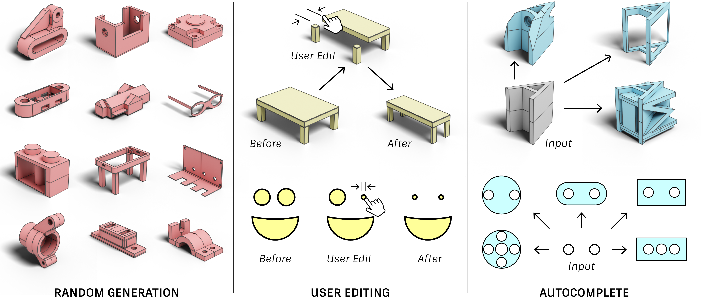

# Hierarchical Neural Coding for Controllable CAD Model Generation (ICML 2023)

[](https://arxiv.org/abs/)
[](https://hnc-cad.github.io/) 
[](https://www.youtube.com/)

*[Xiang Xu](https://samxuxiang.github.io/), [Pradeep Kumar Jayaraman](https://www.research.autodesk.com/people/pradeep-kumar-jayaraman/), [Joseph G. Lambourne](https://www.research.autodesk.com/people/joseph-george-lambourne/), [Karl D.D. Willis](https://www.karlddwillis.com/), [Yasutaka Furukawa](https://www.cs.sfu.ca/~furukawa/)*



> We present a novel generative model for
Computer Aided Design (CAD) that 1) represents high-level design concepts of a CAD model as a
three-level hierarchical tree of neural codes, from global part arrangement down to local curve geometry; and 2) controls the generation of CAD models by specifying the target design using a code tree. Our method supports diverse and higher-quality generation; novel user controls while specifying design intent; and autocompleting a partial CAD model under construction.

<!-- <p align="center">


</p>
<p align="center">
A demo video of our program is available on our <a href="https://threedle.github.io/GeoCode/">project page</a>.
</p> -->

## Requirements

### Environment
- Linux
- Python 3.8
- CUDA >= 11.4
- GPU with 24 GB ram recommended

### Dependencies
- PyTorch >= 1.10
- Install pythonocc following the instruction [here](https://github.com/tpaviot/pythonocc-core).
- Install other dependencies:
    ```
    pip install -r requirements.txt
    ```
### Docker
We provide our docker image [here](https://hub.docker.com/r/samxuxiang/skexgen). Note: only tested on CUDA 11.4. 


## Training the model

Download our processed DeepCAD dataset, original data is available [here](https://github.com/ChrisWu1997/DeepCAD). Follow the processing steps [here](https://github.com/samxuxiang/SkexGen) if you want to process your own data.
```bash
python scripts/download.py
```


## Running the test-set evaluation using our dataset and saved checkpoint

<p align="center">

</p>

### Installation

Clone and create the Conda environment
```bash
git clone https://github.com/threedle/GeoCode.git
cd GeoCode
conda env create -f environment.yml
conda activate geocode
python setup.py install

# Install Blender 3.2 under `~/Blender`
./scripts/install_blender3.2.sh

# Download the dataset (`~/datasets`), checkpoint (`~/models`) and blend file (`~/blends`) of the `chair` domain
python scripts/download_ds.py --domain chair --datasets-dir ~/datasets --models-dir ~/models --blends-dir ~/blends
```

`vase` and `table` domains are also available

### Run the test for the chair domain (1 GPU and 20 CPUs setup is recommended)

Run the test for the `chair` domain using the downloaded checkpoint, make sure the directories match the directories that were used in the `download_ds.py` step
```bash
cd GeoCode
conda activate geocode
python geocode/geocode.py test --blender-exe ~/Blender/blender-3.2.0-linux-x64/blender --blend-file ~/blends/procedural_chair.blend --models-dir ~/models --dataset-dir ~/datasets/ChairDataset --input-type pc sketch --phase test --exp-name exp_geocode_chair
```

This will generate the results in the following directory structure, in 
```
<datasets-dir>
│
└───ChairDataset
    │
    └───test
        │
        └───results_exp_geocode_chair
            │
            └───barplot                    <-- model accuracy graph
            └───obj_gt                     <-- 3D objects of the ground truth samples
            └───obj_predictions_pc         <-- 3D objects predicted from point cloud input
            └───obj_predictions_sketch     <-- 3D objects predicted from sketch input
            └───yml_gt                     <-- labels of the ground truth objects
            └───yml_predictions_pc         <-- labels of the objects predicted from point cloud input
            └───yml_predictions_sketch     <-- labels of the objects predicted from sketch input
```

We also provide a way to automatically render the resulting 3D objects. Please note that this step is GPU intensive due to rendering, the use of multiple nodes with GPU is recommended. Please see the additional information for running this in parallel.

```bash
cd GeoCode
conda activate geocode
~/Blender/blender-3.2.0-linux-x64/blender ~/blends/procedural_chair.blend -b --python visualize_results/visualize.py -- --dataset-dir ~/datasets/ChairDataset --phase test --exp-name exp_geocode_chair
```

this will generate the following additional directories under `results_exp_geocode_chair`:
```
            ⋮
            └───render_gt                  <-- renders of the ground truth objects
            └───render_predictions_pc      <-- renders of the objects predicted from point cloud input
            └───render_predictions_sketch  <-- renders of the objects predicted from sketch input
```

## Run training on our dataset (1 GPU and 5 CPUs setup is recommended)

Training from a checkpoint or new training is done similarly, and only depends on the existence of a `latest.ckpt` checkpoint file in the experiment directory (under `~/models` in this example).
Please note that training using our checkpoints will show a starting epoch of 0.

```bash
cd GeoCode
conda activate geocode
python geocode/geocode.py train --models-dir ~/models --dataset-dir ~/datasets/ChairDataset --nepoch=600 --batch_size=33 --input-type pc sketch --exp-name exp_geocode_chair
```

## Inspecting the blend files

Open one of the Blend files using Blender 3.2.

To modify the shape using the parameters and to inspect the Geometry Nodes Program click the "Geometry Node" workspace at the top of the window


Then you will see the following screen


# Additional Information

## Logging

For logging during training, we encourage the use of [neptune.ai](https://neptune.ai/).
First open an account and create a project, create the file `GeoCode/config/neptune_config.yml` with the following content:

```
neptune:
  api_token: "<TOKEN>"
  project: "<POJECT_PATH>"
```
## Downloading the datasets, blend files, and checkpoint files
When downloading one or more domain using:
```bash
python scripts/download_ds.py --domain chair --datasets-dir ~/datasets --models-dir ~/models --blends-dir ~/blends
python scripts/download_ds.py --domain vase --datasets-dir ~/datasets --models-dir ~/models --blends-dir ~/blends
python scripts/download_ds.py --domain table --datasets-dir ~/datasets --models-dir ~/models --blends-dir ~/blends
```

The resulting directory structure will be (example for the `chair` domain):

```
<datasets-dir>
│
└───ChairDataset
    │
    └───recipe.yml
    │
    └───train
    │   └───obj_gt
    │   └───point_cloud_fps
    │   └───point_cloud_random
    │   └───sketches
    │   └───yml_gt
    │   └───yml_gt_normalized
    │
    └───val
    │   └───obj_gt
    │   └───...
    │
    └───test
        └───obj_gt
        └───...
        
<models-dir>
│
└───exp_geocode_chair
    │
    └───procedural_chair_epoch585_ckpt.zip
    └───procedural_chair_last_ckpt.zip
    └───procedural_chair_epoch585.ckpt
    └───last.ckpt

<blends-dir>
│
└───procedural_chair.blend
```

## Visualize the results using multiple GPU nodes in parallel

When visualizing the results, we render an image for each ground truth and prediction 3D object that were created while running the test-set evaluation. Since this is GPU intensive task, we provide a way to run this in parallel on multiple GPU machines.
To do so, simply add the flags `--parallel 10 --mod $NODE_ID` to the visualization command, for example, for 10 nodes:

```bash
cd GeoCode
conda activate geocode
~/Blender/blender-3.2.0-linux-x64/blender ~/blends/procedural_chair.blend -b --python visualize_results/visualize.py -- --dataset-dir ~/datasets/ChairDataset --phase test --exp-name exp_geocode_chair --parallel 10 --mod $NODE_ID
```

where `$NODE_ID` is the node id.

## Creating a new dataset

### Step 1 - define the dataset
You can optionally edit the `dataset_generation` or the `camera_angles` sections in the appropriate `recipe` YAML file. For example, for the chair domain, edit the following recipe file:
`GeoCode/dataset_generator/recipe_files/chair_recipe.yml`. We encourage the user to inspect the relevant Blend file before modifying the recipe file.

### Step 2 - generate the raw objects (20 CPUs with 8GB memory per CPU is recommended)
In this step no GPU and no conda env are required.

For example, generating the val, test, and train datasets for the chair domain, with 3, 3, and 30 shape variation per parameter value, is done using the following commands: 

```bash
cd GeoCode
~/Blender/blender-3.2.0-linux-x64/blender ~/blends/procedural_chair.blend -b --python dataset_generator/dataset_generator.py -- generate-dataset --dataset-dir ~/datasets/MyChairDataset --domain chair --phase val --num-variations 3 --parallel 20
~/Blender/blender-3.2.0-linux-x64/blender ~/blends/procedural_chair.blend -b --python dataset_generator/dataset_generator.py -- generate-dataset --dataset-dir ~/datasets/MyChairDataset --domain chair --phase test --num-variations 3 --parallel 20
~/Blender/blender-3.2.0-linux-x64/blender ~/blends/procedural_chair.blend -b --python dataset_generator/dataset_generator.py -- generate-dataset --dataset-dir ~/datasets/MyChairDataset --domain chair --phase train --num-variations 30 --parallel 20
```

For vase domain
```bash
~/Blender/blender-3.2.0-linux-x64/blender ~/blends/procedural_vase.blend -b --python dataset_generator/dataset_generator.py -- generate-dataset --dataset-dir ~/datasets/MyVaseDataset --domain vase --phase val --num-variations 3 --parallel 20
~/Blender/blender-3.2.0-linux-x64/blender ~/blends/procedural_vase.blend -b --python dataset_generator/dataset_generator.py -- generate-dataset --dataset-dir ~/datasets/MyVaseDataset --domain vase --phase test --num-variations 3 --parallel 20
~/Blender/blender-3.2.0-linux-x64/blender ~/blends/procedural_vase.blend -b --python dataset_generator/dataset_generator.py -- generate-dataset --dataset-dir ~/datasets/MyVaseDataset --domain vase --phase train --num-variations 30 --parallel 20
```

For table dataset
```bash
~/Blender/blender-3.2.0-linux-x64/blender ~/blends/procedural_table.blend -b --python dataset_generator/dataset_generator.py -- generate-dataset --dataset-dir ~/datasets/MyTableDataset --domain table --phase val --num-variations 3 --parallel 20
~/Blender/blender-3.2.0-linux-x64/blender ~/blends/procedural_table.blend -b --python dataset_generator/dataset_generator.py -- generate-dataset --dataset-dir ~/datasets/MyTableDataset --domain table --phase test --num-variations 3 --parallel 20
~/Blender/blender-3.2.0-linux-x64/blender ~/blends/procedural_table.blend -b --python dataset_generator/dataset_generator.py -- generate-dataset --dataset-dir ~/datasets/MyTableDataset --domain table --phase train --num-variations 30 --parallel 20
```

Please note that the shapes generated in this step are already normalized.

### Step 3 - generate the sketches (usage of multiple nodes with GPU is recommended)

This step does not require a conda env but requires GPU(s)

```bash
cd GeoCode
~/Blender/blender-3.2.0-linux-x64/blender ~/blends/procedural_vase.blend -b --python dataset_generators/sketch_generator.py -- --dataset-dir ~/datasets/MyChairDataset --phases val test train
```

You can also run this in parallel, for example, with 10 processes, by adding the flags `--parallel 10 --mod $NODE_ID`

Once you train on the new dataset, a preprocessing step of the dataset will be performed. The point cloud sampling and normalized label directories and files will be created under the dataset directory. Refer to the `Download the datasets` section at the top of this readme for the directory structure.


## Acknowledgement
Our implementation is based ob Stable Diffusion text-to-image model from Hugging Face's [Diffusers](https://github.com/huggingface/diffusers) library, combined with [Diffvg](https://github.com/BachiLi/diffvg). The framework is built on [Live](https://github.com/Picsart-AI-Research/LIVE-Layerwise-Image-Vectorization).
    
## Citation
If you use this code for your research, please cite the following work: 
```
@misc{iluz2023wordasimage,
      title={Word-As-Image for Semantic Typography}, 
      author={Shir Iluz and Yael Vinker and Amir Hertz and Daniel Berio and Daniel Cohen-Or and Ariel Shamir},
      year={2023},
      eprint={2303.01818},
      archivePrefix={arXiv},
      primaryClass={cs.CV}
}
```
